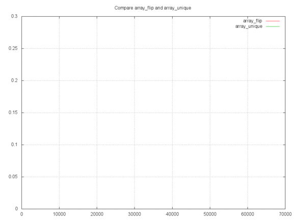

# PHPench

PHPench creates a graphical output for a PHP benchmark.
Plot the runtime of any function in realtime with GnuPlot and create an image
out of the result.

## Installation

1.) Add this package to your composer.json

```
{
    "require": {
      "mre/phpench": "*@dev"
    }
}
```

2.) Install gnuplot

For *Mac OS X* you can install gnuplot via homebrew. For live generated charts you also need to install XQuartz.
```
Without X11 support:
$ brew install gnuplot

With X11 supprt (recommended!):
$ brew install gnuplot --with-x
```

For *Linux* use your package manager.
```
apt-get install gnuplot
```

3.) Look at the examples for usage

## Example

```PHP
<?php

require_once __DIR__.'/vendor/autoload.php';

// setup our test data
function createArray($arrSize)
{
    $test = array();
    for ($i=1; $i<$arrSize; $i++) {
        $test[$i]= $arrSize % $i;
    }

  return $test;
}

/**
 * These are the functions that we want to benchmark
 *
 * This test compares array_flip vs array_unique
 */
$benchFunction1 = function ($arrSize) {
    $test = createArray($arrSize);
    $test = array_flip(array_flip($test));
};
$benchFunction2 = function ($arrSize) {
    $test = createArray($arrSize);
    $test = array_unique($test);
};

// Create a new benchmark instance
$phpench = new mre\PHPench('Compare array_flip and array_unique');

// Add your test to the instance
$phpench->addTest($benchFunction1, 'array_flip');
$phpench->addTest($benchFunction2, 'array_unique');

// Run the benchmark and plot the results in realtime.
// With the second parameter you can specify
// the start, end and step for each call
$phpench->plot(range(1,pow(2,16), 1024));
$phpench->save('test.png', 1024, 768);
```



## Maintainers

Matthias Endler (@matthiasendler)  
Markus Poerschke (@markuspoerschke)

## License

Apache License Version 2.0
